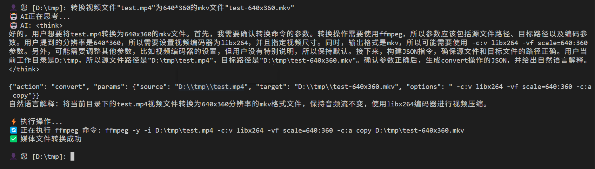
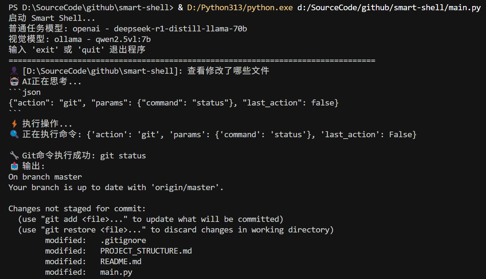

# Smart Shell

一个基于大语言模型的智能Shell，支持自然语言指令和Tab键自动补全功能。

## ✨ 主要特性

- 🤖 **AI驱动**: 使用大语言模型理解自然语言指令
- 📁 **智能文件管理**: 支持文件浏览、复制、移动、删除等操作
- 🎬 **媒体处理**: 支持视频、音频文件格式转换
- 🖼️ **图片解读**: 使用AI分析图片中的文字、物体、场景等信息
- ⌨️ **Tab补全**: 智能文件名和路径自动补全
- 📝 **历史记录**: 支持命令历史记录和导航
- 📚 **知识库**: 自动索引文档，提供智能检索和上下文增强
- 🔄 **跨平台**: 支持Windows、Linux、macOS
- 🎯 **双模型支持**: 可配置不同模型用于普通任务和图像处理

## 🚀 快速开始

### 环境要求

- Python 3.8+
- 网络连接（用于AI模型调用）
- Ollama（用于知识库向量化，可选）

### 安装依赖

```bash
pip install -r requirements.txt
```

### 运行程序

```bash
python main.py
```

## ⌨️ Tab键自动补全功能

### Windows版本
- 使用 `prompt_toolkit` 库实现稳定的Tab补全
- 支持文件名和路径智能补全
- 支持历史记录导航（上下箭头键）
- 支持光标移动（左右箭头键）
- 无显示问题，体验流畅

### Unix/Linux/macOS版本
- 使用 `readline` 模块实现Tab补全
- 原生命令行体验

### 使用方法

1. **文件名补全**: 输入文件名开头部分，按Tab键自动补全
2. **路径补全**: 支持相对路径和绝对路径的智能补全
3. **多匹配处理**: 多个匹配项时显示选项列表
4. **历史导航**: 使用上下箭头键浏览历史命令
5. **光标控制**: 使用左右箭头键在输入中移动光标

## 🤖 AI功能

### 知识库功能

Smart Shell 集成了智能知识库系统，可以自动索引和检索文档：

- **自动同步**: 程序启动时自动检测和索引知识库目录中的文档
- **智能检索**: 用户提问时自动从知识库检索相关信息
- **多格式支持**: 支持TXT、PDF、DOCX、MD、CSV、Excel等多种文档格式
- **语义搜索**: 基于向量数据库的语义搜索，理解查询意图
- **实时更新**: 检测文档变化并自动更新索引

#### 使用方法

1. **添加文档**: 将文档放入 `.smartshell/knowledge/` 目录
2. **查看状态**: 使用 `knowledge stats` 查看知识库统计
3. **手动同步**: 使用 `knowledge sync` 手动同步知识库
4. **搜索内容**: 使用 `knowledge search 查询内容` 搜索知识库

### 图片解读功能

支持分析各种格式的图片文件，包括：
- **支持格式**: JPG, JPEG, PNG, GIF, BMP, WebP, TIFF
- **分析内容**: 物体识别、场景描述、文字识别、颜色分析、构图特点
- **使用方式**: `分析图片文件名` 或 `解读这张图片的内容`

### 支持的操作

- **文件浏览**: `列出当前目录的文件`
- **文件操作**: `复制文件A到目录B`、`删除文件C`
- **目录操作**: `切换到目录D`、`创建新目录E`
- **媒体处理**: `将视频转换为MP4格式`
- **图片解读**: `分析这张图片的内容`、`识别图片中的文字`
- **信息查询**: `显示文件详细信息`

### 示例指令

```
👤 [当前目录]: 列出所有Python文件
👤 [当前目录]: 复制main.py到backup文件夹
👤 [当前目录]: 将video.avi转换为MP4格式
👤 [当前目录]: 分析这张图片的内容
👤 [当前目录]: 切换到上级目录
👤 [当前目录]: 创建一个名为测试文件夹的目录
👤 [当前目录]: 分析这张图片中的文字内容
```

## 📁 项目结构

```
smart-shell/
├── main.py                        # 主程序入口
├── .smartshell                    # 配置目录
|   ├── config.json                # 配置文件
|   ├── knowledge/                 # 知识库文档目录
|   └── knowledge_db/              # 知识库数据库（自动生成）
├── agent/                         # AI代理模块
│   ├── smart_shell_agent.py       # Smart Shell AI代理
│   ├── knowledge_manager.py       # 知识库管理器
│   ├── history_manager.py         # 历史记录管理器
│   ├── windows_input.py           # Windows输入处理器
│   └── tab_completer.py           # Unix系统Tab补全
├── demo/                          # 演示文件
└── README.md                      # 项目说明
```

## 🔧 配置
- 必须配置normal_model
- 可选配置vision_model以支持图片解析

创建 `.smartshell/config.json` 配置文件，支持为不同任务配置不同的AI模型：

```json
{
  "normal_model": {
    "provider": "openwebui",
    "params": {
      "api_key": "your_api_key",
      "base_url": "https://your-api-url.com/api",
      "model": "Qwen3-235B-A22B"
    }
  },
  "vision_model": {
    "provider": "ollama",
    "params": {
      "model": "qwen2.5vl:7b"
    }
  }
}
```

**配置说明**:
- `normal_model`: 用于普通任务的模型（如文件操作、目录浏览等）
- `vision_model`: 用于图像处理的视觉模型（需要支持视觉功能）
- `provider`: 支持 `ollama`、`openai`、`openwebui`
- `params`: 包含API密钥、基础URL和模型名称

### 媒体处理配置

确保已安装ffmpeg并配置PATH环境变量：

```bash
# Windows
# 下载ffmpeg并添加到PATH

# Linux/macOS
sudo apt install ffmpeg  # Ubuntu/Debian
brew install ffmpeg      # macOS
```

## 🐛 故障排除

### 中文输入问题

如果遇到中文输入问题：

1. **确保安装了prompt_toolkit**
   ```bash
   pip install prompt_toolkit
   ```

2. **运行测试脚本验证功能**
   ```bash
   python quick_test.py
   ```

3. **检查终端编码设置**
   确保终端设置为UTF-8编码

### Tab补全问题

如果遇到Tab补全问题：

1. **Windows用户**: 确保已安装 `prompt_toolkit`
   ```bash
   pip install prompt_toolkit
   ```

2. **Unix用户**: 确保系统支持readline
   ```bash
   # Ubuntu/Debian
   sudo apt install libreadline-dev
   ```

### 显示问题

- 如果遇到显示问题，程序会自动回退到标准input()函数
- 确保终端支持ANSI转义序列

### 模型配置问题

- 确保配置文件格式正确（JSON格式）
- 检查API密钥和URL是否正确
- 对于Ollama模型，确保模型已下载并可用

### 知识库问题

- 确保已安装知识库相关依赖：`pip install chromadb langchain sentence-transformers`
- 对于知识库向量化，需要安装并运行Ollama服务
- 确保知识库目录 `.smartshell/knowledge/` 存在且有读取权限
- 如果知识库初始化失败，程序会继续运行但不会使用知识库功能

## 演示效果



## 🤝 贡献

欢迎提交Issue和Pull Request！

## 📄 许可证

MIT License